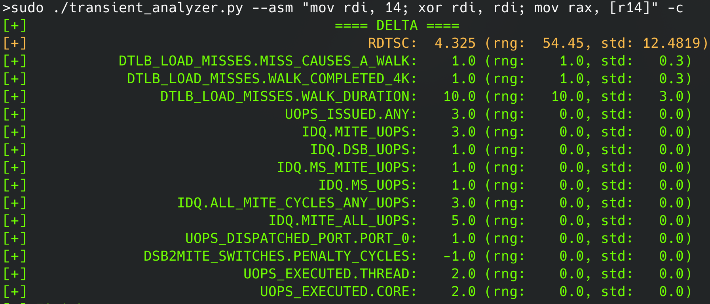

# TransientAnalyzer
A nanoBench plugin to analyze instructions during transient execution.

## Examples

### Normalmode Example


The above picture shows the performance counter impact of the following code snippet:
```
mov rdi, 14
xor rdi, rdi
mov rax, [r14]
```
The code snippet is never architecturally executed by only executed inside a transient window. Besides the aggregated values over multiple runs, the tool also outputs the "range" of the values (`rng`), i.e., max(values) - min(values) and the standard deviation (`std`).
These metrics aim to help users understand whether reported values stem from the executed code snippet or from system noise.

## Installation
As TransientAnalyzer itself does not require additional contraints, the installation is mainly nanoBench itself:
```
sudo apt install python3 python3-plotly
git submodule --init update
cd nanoBench
make kernel
```
Afterward, the nanoBench kernel module needs to be loaded:
```
sudo insmod nanoBench/kernel/nb.ko
```

## Usage
The tool supports the following command line flags

| Option          | Description             |
|-----------------|-------------------------|
| `-asm <asm-code>`      | Assembly code to measure|
| `-asmfile <filename>`      | Assembly file to measure|
| `-asminit <asm-code>`      | Assembly initialization code (see nanoBench Docs)|
| `-asminitfile <filename>`      | Assembly initialization file |
| `-user/-u`      | Measure in userspace (unreliable) | 
| `-cycle-by-cycle/--cbc`    | Enable Cycle-By-Cycle (CBC) mode | 
| `--raw/-r`     | Do not crop to the first/last cycle approximation (only CBC mode)
| `--architectural/-a`     | Execute code without non-transiently |
| `--clean/-c`     | Only show PMC values not between -1 and 1|
| `--non-zero/--nz`     | Only show PMC values not between -1 and 1|
| `--verbose/-v`     | Enable verbose logging  |


## Implementation
The tool takes the given assembly code and wraps it in code that leads to a misprediction of the return stack buffer (RSB).
The given assembly code inserted at mispredicted location, hence the CPU will transiently execute the given code.
As the wrapper code is written to create a stable footprint in the performance counters (PMCs), its impact can be calculated and substracted from the observed PMC measurements.
More precisely, this is achieved by executing the code twice, one with the user-provided assembly code and once with code immediately leading to an abort of the transient execution.

## Disclaimer
The code is provided as-is. You are responsible for protecting yourself, your property and data, and others from any risks caused by this code. This code may cause unexpected and undesirable behavior to occur on your machine.